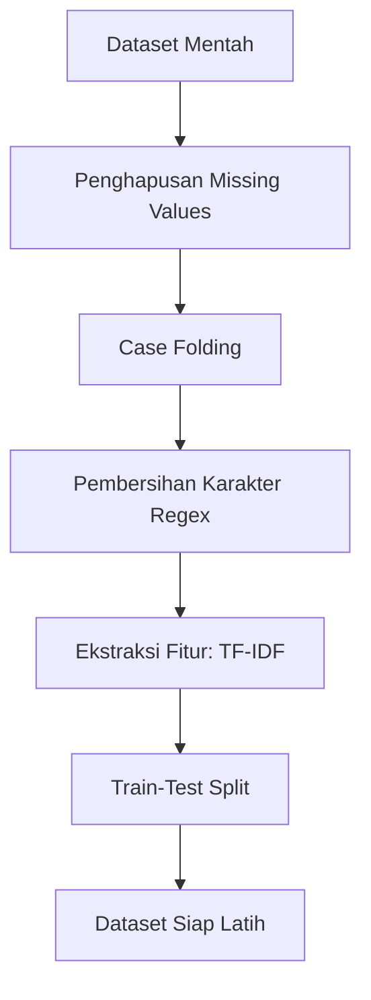

# Dokumentasi Preprocessing: Deteksi Hoaks Politik

## 1. Tantangan Data

Dataset awal berupa kumpulan teks artikel berita politik yang diambil dari berbagai portal (CNN, Kompas, Tempo, dan TurnBackHoax). Karena berasal dari *web scraping* dan sumber yang beragam, teks mentah ini sangat berantakan:

*   **Inkonsistensi Huruf:** Terdapat campuran huruf kapital dan kecil yang bisa dianggap sebagai kata berbeda oleh komputer (misal: "Presiden" dan "presiden").
*   **Karakter Tidak Relevan:** Banyak mengandung tanda baca, angka, *link* URL, atau simbol khusus (seperti `@`, `#`, `!`) yang tidak memberikan makna kontekstual untuk klasifikasi sentimen hoaks.
*   **Format Mesin:** Algoritma *Machine Learning* (Logistic Regression) tidak bisa membaca teks berupa huruf; teks harus diubah menjadi matriks angka (vektor).

## 2. Alur Preprocessing

## 3. Detail Setiap Langkah

### 3.1 Penghapusan Missing Values (Drop NA)
**Masalah:** Beberapa baris dalam dataset (*dataframe*) mungkin kehilangan informasi teksnya saat proses pengumpulan data.
**Solusi:** Baris yang kosong dihapus menggunakan metode `df.dropna()`.
**Justifikasi:** Teks kosong tidak dapat diekstraksi fiturnya dan akan menyebabkan *error* komputasi pada model.

### 3.2 Case Folding
**Masalah:** Komputer bersifat *case-sensitive*.
**Solusi:** Mengubah seluruh teks menjadi huruf kecil menggunakan fungsi `text.lower()`.
**Justifikasi:** Menyempitkan ukuran kamus kata (*vocabulary*). Kata "Politik", "POLITIK", dan "politik" akan dihitung sebagai satu entitas yang sama.

### 3.3 Pembersihan Karakter dengan Regex
**Masalah:** Angka dan tanda baca seringkali menjadi *noise* (gangguan) dalam teks.
**Solusi:** Menggunakan *Regular Expression* (Regex) `re.sub(r'[^a-zA-Z\s]', '', text)` untuk menghapus semua karakter selain huruf alfabet (a-z) dan spasi.
**Justifikasi:** Algoritma ini berfokus pada pola kata, bukan struktur tanda baca. Menghilangkan angka dan simbol membantu memfokuskan model pada bahasa provokatif atau gaya jurnalistik.

### 3.4 Ekstraksi Fitur (TF-IDF Vectorizer)
**Masalah:** *Logistic Regression* adalah model matematika yang membutuhkan input berupa angka metrik, bukan serangkaian *string*.
**Solusi:** Menggunakan metode **Term Frequency-Inverse Document Frequency (TF-IDF)** dengan batasan `max_features=5000`.
**Justifikasi:** 
*   **TF-IDF** menilai seberapa penting sebuah kata dalam dokumen dibandingkan dengan seluruh dataset. Kata yang sering muncul di satu berita hoaks tetapi jarang di berita valid akan mendapat bobot tinggi.
*   Pembatasan **5.000 fitur** (kata teratas) dilakukan untuk efisiensi RAM/komputasi tanpa membuang informasi yang krusial.

### 3.5 Train-Test Split
Membagi dataset untuk melatih dan menguji model guna mencegah model menghafal data (*overfitting*).

| Split | Persentase | Kegunaan |
| :--- | :--- | :--- |
| **Train Set** | 80% | Digunakan untuk melatih algoritma Logistic Regression |
| **Test Set** | 20% | Digunakan sebagai simulasi data baru untuk menguji performa model (menghasilkan akurasi 99.35%) |

## 4. Output

Proses preprocessing ini menghasilkan dua elemen utama yang disimpan ke dalam sistem untuk digunakan pada tahap *deployment* (aplikasi Streamlit):

*   `data/processed/dataset_bersih.csv` — Dataset teks yang sudah dibersihkan (diabaikan dari Git karena ukurannya yang besar).
*   `models/tfidf_vectorizer.pkl` — Model pembobotan bahasa yang telah dilatih, digunakan untuk mengubah teks *input* dari pengguna baru menjadi angka sebelum diprediksi.